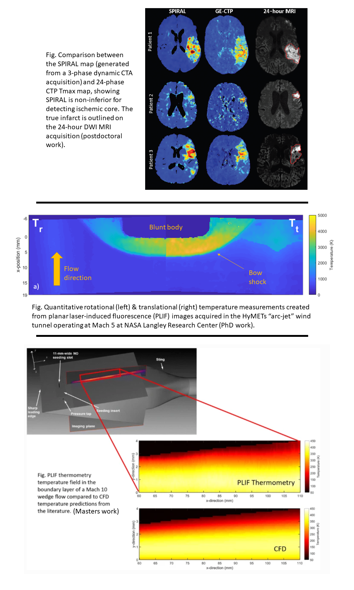

### Connor McDougall, PhD
#### Research portfolio website
___

| **HOME** | [About](about.md) | [CV](cv.md) | [Blog](blog.md) | [Publications](publications.md) |

___

### Welcome!
Welcome to my research website! I am a multidisciplinary imaging scientist currently working as a postdoctoral associate in the [Stroke & Cognition Research Group](https://cumming.ucalgary.ca/cerebral-circulation-cognition/stroke-cognition) led by [Dr. Philip Barber](https://cumming.ucalgary.ca/departments/dcns/about/faculty/barber). This site is maintained as a directory for access to my work across multiple websites and paltforms, as well as a programming blog which provides helpful tutorials & walkthroughs of practical problems to help with building python-based analysis pipelines (coming soon). If you have any questions, don't hesistate to reach out by email: connor.mcdougall1@ucalgary.ca.

### Gallery

### Helpful links

| Genral      | Links       |
| ----------- | ----------- |
| UCalgary profile      | [click here](https://profiles.ucalgary.ca/connor-mcdougall)      |
| LinkedIn   | Text        |

| Description |
| ----------- |
| Stroke - University of Calgary |
| [Stroke & Cognition Research Group](https://cumming.ucalgary.ca/cerebral-circulation-cognition/stroke-cognition) |
| [Stroke & Cognition Research Group](https://cumming.ucalgary.ca/cerebral-circulation-cognition/stroke-cognition) |
| Aerospace |
| [AIAA](https://www.aiaa.org/) |
| [Stroke & Cognition Research Group](https://cumming.ucalgary.ca/cerebral-circulation-cognition/stroke-cognition) |
___

*Note: A clone of this site is backed up to the Ethereum blockchain through IPFS and the Polygon layer 2. To access that site, along with my blog about building solidity-based blockchain applications, follow the link [here](https://ccmcdougall.eth.limo) - coming soon.*
